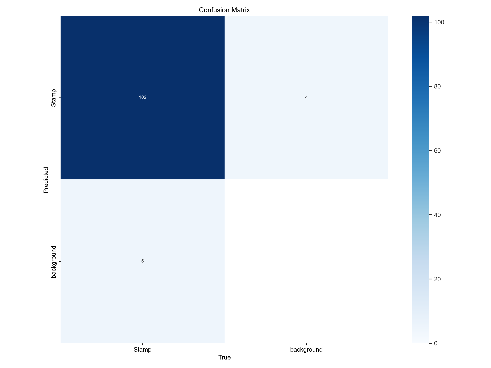
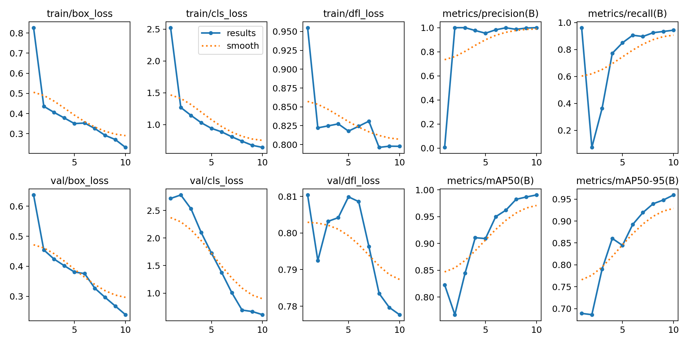
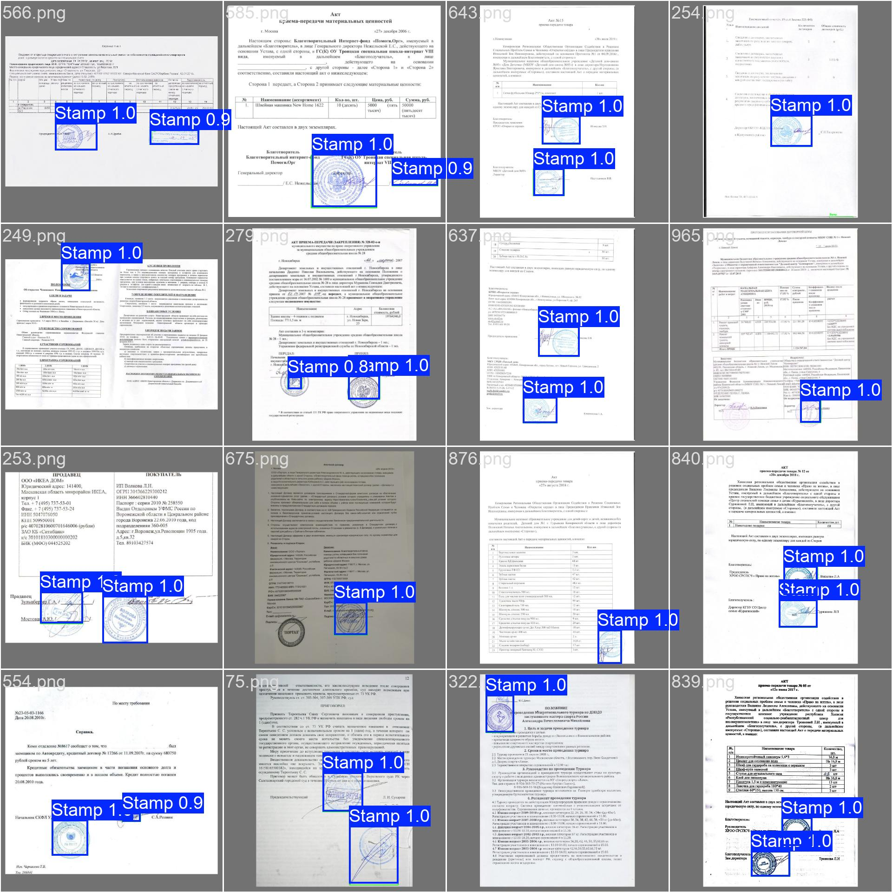

# Stamp-Detection
Two models for detecting and localizing stamps in document images, one based on traditional image processing techniques, and another using a YOLO-based deep learning approach.

## Dataset Source

The dataset is a manually assembled open source dataset for the tasks of finding seals and signatures.

The dataset is from **Kaggle** at this link: [Signatures and Stamps](https://www.kaggle.com/datasets/igorkarayman/signatures-and-stamps/data).

## Labeled Dataset Source

To generate labeled data, I built a Streamlit application in this script **label_images_app.py** that uses a stamp detection algorithm based on traditional image processing techniques. This application automatically labeled 300 images from the original Kaggle dataset, creating YOLO-compatible annotations for training purposes.

The labeled dataset can be found here: [Labeled Stamps](https://kaggle.com/datasets/b4929ea694c75fca467320bd956de9e6474d1c208d5a48cdb8449f4a6c48f715).


## Installation

Follow these steps to set up the project on your local machine:

1. Clone the repository:

```bash
git clone https://github.com/your-username/stamp-detection.git
cd stamp-detection
```

2. Install Poetry
If you don't have Poetry installed, you can install it using pip:

```bash
pip install poetry
```

3. Install dependencies and set up the environment

```bash
poetry install
```

4. Activate the virtual environment

```bash
poetry shell
```

5. Run the main application
This application allows you to upload a document image and detect stamps using one of two models:

- An algorithm based on traditional image processing techniques.
- A trained YOLO model.


```bash
streamlit run app.py
```

6. Run the automated labeling tool
This Streamlit tool labels images using the image-processing-based stamp detector and saves them in YOLO format.

```bash
streamlit run label_images_app.py
```

## Alternative Installation

1. Export dependencies from Poetry to requirements.txt

```bash
poetry export -f requirements.txt --output requirements.txt
```

2. Create and activate a virtual environment using Python

```bash
python -m venv venv
source venv/bin/activate
```

3. Install dependencies

```bash
pip install -r requirements.txt
```

4. Run the main application

```bash
streamlit run app.py
```

5. Run the automated labeling tool

```bash
streamlit run label_images_app.py
```

## How the Image Processing based Algorithm Works

## YOLO Model Training Pipeline

The YOLO-based model was trained using a carefully curated subset of images from the original Kaggle dataset.

Here's how the training process was carried out:

- We started with a dataset of **1,000 raw document images** from [Kaggle](https://www.kaggle.com/datasets/igorkarayman/signatures-and-stamps/data).
- To generate labeled data, we used the `label_images_app.py` Streamlit application, which automatically detects stamps using an image-processing-based algorithm.
- This automated labeling tool was run across the full dataset. From those, **300 high-quality images** were selected where the detections were very accurate.
- The selected 300 images were converted to **YOLO format** annotations.
- The dataset was then split into **80% training** and **20% validation** sets.
- We trained a `YOLOv8n` (YOLOv8 nano) model on this curated dataset.

### Training Results

After training, we evaluated the model using various metrics and visualizations:

1. **Confusion Matrix** – Shows true positives, false positives, etc.

2. **Training & Validation Metrics** – Includes precision, recall, mAP, and loss curves.

3. **Sample Predictions** – Visual samples of batch predictions on the validation set.


All training artifacts including model weights, logs, and evaluation plots are saved in the [`runs`](./runs) directory.
